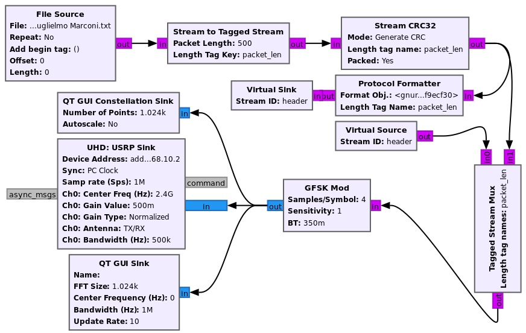
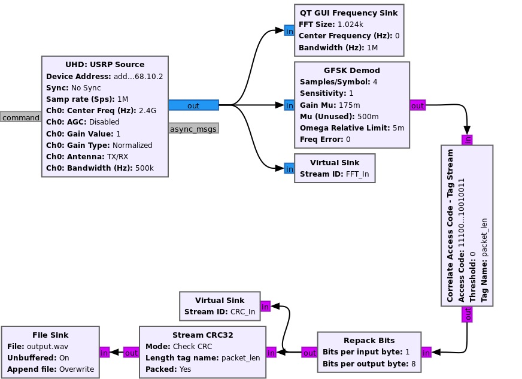

# Benchmark Test

## Overview
Benchmark Test Block is a flexible and easy-to-use benchmark module that can evaluate the performance of SDR-based wireless communication systems over the air using the GNU Radio Companion (GRC). This block can be easily added in the GUI GRC flowgraph to obtain the following performance metrics in a realistic over-the-air communication channel: Packet Error Rate (PER), Packet Loss Rate (PLR), Signal-to-Noise Ratio (SNR), Latency, and Throughput. In addition, it provides information about the total data transmission duration, the correctly/incorrectly received packets, and the total received data size. The output data is displayed in the GRC console window and stored in an external CSV file with more details. This block provides a flexible benchmark method that is not limited by the type of the used SDR dvices or communcation systems assuming that the CRC code is added to the trasmitted packets. A GRC flowgraph example of how to use this block is demonstrated below.

**Important Notes**

•	This block can work with any communication system that uses the cyclic redundancy check (CRC) at the transmitter. Therefore, the CRC should be appended to the transmitted packets before transmission.

•	The user should use this block at the receiver and should first run the receiver before starting data transmission by the transmitter. 

•	The data transmission process should be for a specific period (i.e., the transmitter should stop transmission after some time). 

•	The benchmark block will output performance metrics after approximately 5 seconds of completing the transmission process by the transmitter. 

## Installation
Use the fellowing code to build and install the Benchmark Test block to GNU Radio:
```
git clone https://github.com/muneer85/gr-benchmark.git
cd gr-benchmark
mkdir build
cd build
cmake ..
make
make install  # may need sudo make install
ldconfig      # may need sudo ldconfig
```
The new block can be found in the block list under the "Benchmark Test" category.
If the GNU Radio companion (GRC) is running, you may need to restart the GRC to find the new blocks.

**Requirements**:
GNU Radio (3.10+), Python (3.10+), CMake (3.1.0+), swig 

## Parameters & Input/Output Signals
### Parameters
-	***Output file***:  Path and file name to store the resulting measurement data. If the file already exists, new measurements will be appended to this file in a new row.
-	***Time zone***: The time zone to be used for getting the date/time in the area where the measurement is conducted. The date/time will be stored in the output file with the corresponding measured data. The time zone can be obtained from the IANA time zone database or the attached TimeZones.txt file. 
-	***Test mode***: This option can be used to make the block work in over-the-air mode or simulation mode. This block supports only over-the-air mode while the simulation mode will be added in the future version. 
-	***Modulation order***: It is a parameter M that determines the number of the different symbols that can be transmitted. For example, M=2 for BPSK and M=4 for QPSK. 
-	***Number of sent packets***: Total number of packets transmitted by the transmitter. It can be determined by dividing the total transmitted data size by packet length.
-	***Packet length***: The size of the transmitted packet (payload) in bytes.
-	***FFT vector length***: This parameter determines the number of samples (bins) used in the FFT calculation, which also determines how many points are in the output.
-	***No. of FFT iterations***: The number of iterations used to average the magnitude of the FFT samples (bins). This average process is used in the SNR calculation process and to average the FFT samples at the block output. It is not a critical parameter but can help in getting more accurate and reliable results. 
-	***Channel BW***: The range of frequencies (channel bandwidth) occupied by the transmitted signal in Hz.
-	***Center frequency***: The frequency in hertz used by the transmitter.
-	***Sample rate***: The number of samples per second. This parameter determines the indices of the FFT bins used in the power calculation process. 
-	***TX power***: The transmit power or gain used by the transmitter in dBm or dB. This parameter is only used as a remark added to the measured data in the output file. It is not used in the performance evaluation process. 
-	***Ant. gain***: The antenna gain in dBi or dBd. This parameter is only used as a remark added to the measured data in the output file. It is not used in the performance evaluation process. 
-	***No. of discarded packets***: Number of packets you want to exclude from the error rate calculation for any reason.
-	***Note***: The comment or note you want to add to the measured data stored in the output file. For example, you can add the GPS coordinates or address of the receiver.

  ## Input:
-	***in_sig***: The input port for the FFT samples of the received signal before demodulation. The FFT samples can be generated using the FFT block in GNU Radio with a size defined using the parameter “FFT vector length”. The FFT block output should be directly connected to the “in_sig” input port. However, the input data stream to the FFT block should be first converted to a vector of size “FFT vector length” using the “Stream to Vector” block. 

-	***msg_in_ok & msg_in_fail***: These input message ports are used to receive the status of the CRC-checked packets which can be either correct (ok) or incorrect (fail). These input ports should be connected to the corresponding output ports of the “CRC Check” block in GNU Radio. The data stream entering the “CRC Check” block should be first converted to PDU messages using the “Tagged Stream to PDU” block which is connected to the last point in the receiver GRC flowgraph just before performing the CRC check. 

## Output:
-	***out_sig***: This port can be used to visualize the frequency spectrum of the received signal averaged over multiple readings defined using the parameter “No. of FFT iterations”. It can be connected to the “GUI vector Sink” block to plot the output vectors of data after adjusting the “Vector Size” parameter to “FFT vector length”.

## Example Flowgraph 
The Benchmark Test block can work with various communication systems that use the CRC code in the transmitted packets. Here, we provide an example to show how to use the benchmark test block. In this example, we implement the GRC flowgraphs for the transmitter and the receiver using GFSK modulation as shown in Figures 1 and 2, respectively. We run the GRC flowgraphs of transmitter and receiver on two N210 USRP devices connected to omnidirectional antennas (VERT-2450) separated by a distance of 5m. In this experiment, we transmit the data over the unlicensed 2.4 GHz frequency band using 500 KHz channel bandwidth. The system parameters used in this example are listed in Table I. We make these flowgraphs as simple as possible because the main goal of this example is to demonstrate how the Benchmark tool works. The file source block imports the file we want to transmit. In this example, we transmit both text and waveform audio files. The text file contains a repeated biography of the Italian inventor Guglielmo Marconi who sent the first radio signal. Other file formats can be also sent using the same system. The file data is split into payloads of size equal to the “pck_len” parameter. The CRC code is generated using the “Stream CRC32” block and appended to the payload. Then, the header is created using the “Protocol formatter” block and attached with the payload to finally form packets ready for the modulation process. The generated packets are modulated using the GFSK Mod block and then fed into the USRP Sink to be transmitted via the USRP radio hardware. 

On the receiver side, as shown in Fig. 2, the received complex signal by the USRP source is first demodulated using the GFSK Dem block. Also, the output of the USRP source is fed into the Benchmark Test block by connecting the “FFT_In” virtual sink with the corresponding virtual source shown in Fig. 1. Then, the access code is used to extract the payloads from the demodulated data. The extracted payloads (before CRC check) are fed into the Benchmark Test block via the “CRC_In” virtual Sink connecting to the corresponding virtual source in the CRC flowgraph shown in Fig. 1. Also, the payloads are checked using the “Stream CRC32” block and then the correctly received payload data is stored in the output file defined in the File Sink block.

The Benchmark Test block should be connected to the receiver GRC flowgraph as illustrated in Fig. 1. The user should first run the receiver flowgraph before starting data transmission by the transmitter. The data transmission process should be for a specific period, i.e., the transmitter should stop transmission after some time. The Benchmark Test block will export the performance metrics after completing the transmission process by the transmitter, i.e., after 5 seconds approximately. 

The output performance data and status of each received packet will be displayed in the GRC console window as shown in Fig. 5.


Fig. 4: A sample of the exported perfromance data in the output CSV file.

Fig. 4.	A screenshot for a sample of the performance metrics displayed in the  GRC console window.

In addition, detailed data of the measured performance metrics and some configuration parameters will be automatically exported to an external CSV file chosen using the parameter “output file” in the Benchmark Test block. This file contains the following information: date. time, total duration, throughput, total received bytes, PER, PLR, SNR, correct received packets, incorrect received packets, latency (packet delivery time), total transmitted packets, packet (payload) length, frequency, channel bandwidth, sample rate, transmit power, antenna gain, and notes. The receiver GRC flowgraph can be kept running to receive a new packet measurement. Any new performance data measured by the Benchmark Test block will be appended as a new row in the same output file if it has already been created before.  Figure 5 shows some samples of measured performance data in the output CSV file. The first two rows represent measurements for the transmission of the text file while the remaining rows represent the measurements of transmission of the waveform audio file. We have successfully received both files which are stored using the file sink block at the receiver. 

TABLE I. 	PARAMETERS USED IN THE OVER-THE-AIR DATA TRANSMISSION EXPERIMENT
|Parameter |Value|Unit|Description|
|:-----:|:-----:|:-----:|:-----:|
|Samp_rate|1|Msps|Sampling rate|
|Vector_Size|1024|-|FFT Vector length|
|f|2.4|GHz|Center frequency| 
|BW|500|KHz|Channel bandwidth|
|Mod_order|2|-|Modulation order|
|sps|4|-|Number of samples per symbol|
|file_size|Text file: 516096, Audio file: 188416|bytes|	Size of the transmitted file|
|Num_sent_pkts|1,032|-|Number of sent packets|
|pck_len|500|bytes|Packet length|
|access_key|'11100001010110101110100010010011'|-|Access code|
|FFT_Iter|10|-|Number of iterations used for averaging the FFT samples|
|gain_tx|0.1, 0.5|-|Normalized gain of the transmitter USRP|
|gain_rx|1|-|Normalized gain of the receiver USRP|
|Distance|5|m|Distance between the transmitter and the receiver| 
|Antenna Gian|3|dBi|Gain of transmitter and receiver Antenna |


### Fig.1 : GFSK Transmitter Flowgraph 
{width=10 height=10}

### Fig. 2: GFSK Receiver Flowgraph 


### Fig. 3: Connection of The Benchmark Test Block and the Receiver 


##
